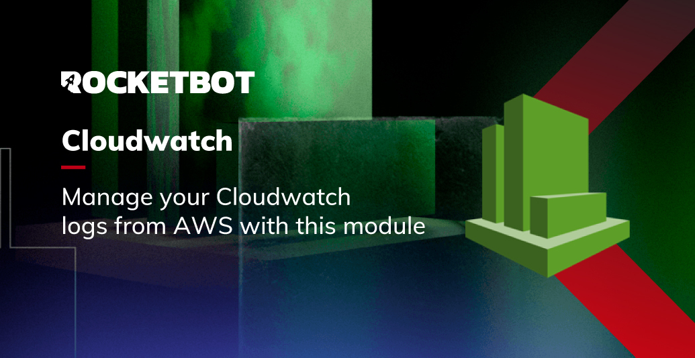

# Cloudwatch
  
Módulo para conexão com o AWS Cloudwatch  

*Read this in other languages: [English](Manual_Cloudwatch.md), [Português](Manual_Cloudwatch.pr.md), [Español](Manual_Cloudwatch.es.md)*
  

## Como instalar este módulo
  
Para instalar o módulo no Rocketbot Studio, pode ser feito de duas formas:
1. Manual: __Baixe__ o arquivo .zip e descompacte-o na pasta módulos. O nome da pasta deve ser o mesmo do módulo e dentro dela devem ter os seguintes arquivos e pastas: \__init__.py, package.json, docs, example e libs. Se você tiver o aplicativo aberto, atualize seu navegador para poder usar o novo módulo.
2. Automático: Ao entrar no Rocketbot Studio na margem direita você encontrará a seção **Addons**, selecione **Install Mods**, procure o módulo desejado e aperte instalar.  

## Descrição do comando

### Conectar ao AWS
  
Este comando permite que você se conecte à sua conta AWS, para isso você precisa do seu Access Key Id e do seu Secret Access Key, você pode obter esses dados no console da AWS, na seção Security Credentials.
|Parâmetros|Descrição|exemplo|
| --- | --- | --- |
|Access Key ID|Identificador da conta AWS|IKAMLSURT6HYUHRY48EF|
|Secret Access Key|Chave secreta da conta AWS|JYFifnrufd2pGHJ2illrZMVnhwxQnHSY5JK6JdhCtu|
|Região|Região da AWS|us-east-1|
|Atribuir resultado à variável|Variável onde será armazenado o estado da conexão, retorna True se for bem sucedida ou False caso contrário|Variable|

### Criar Grupo de Log
  
Este comando permite criar um grupo de log no Cloudwatch. Você deve ter a permissão IAM: "logs: CreateLogGroup"
|Parâmetros|Descrição|exemplo|
| --- | --- | --- |
|Nome do grupo de log|Nome do grupo de log a ser criado|new_log_group|
|Atribuir resultado à variável|Variável onde será armazenado o resultado, retorna True se for bem-sucedido ou False caso contrário|Variable|

### Excluir Grupo de Log
  
Este comando permite excluir um grupo de log no Cloudwatch. Você deve ter a permissão IAM: "logs:DescribeLogGroups"
|Parâmetros|Descrição|exemplo|
| --- | --- | --- |
|Nome do grupo de log|Nome do grupo de log a ser excluído|log_group_name|
|Atribuir resultado à variável|Variável onde será armazenado o resultado, retorna True se for bem-sucedido ou False caso contrário|Variable|

### Criar Fluxo de Log
  
Este comando permite criar um fluxo de log no Cloudwatch. Você deve ter a permissão IAM: "logs:CreateLogStream"
|Parâmetros|Descrição|exemplo|
| --- | --- | --- |
|Nome do grupo de log|Nome do grupo de log onde o fluxo será criado. Deve existir previamente.|log_group_name|
|Nome do fluxo de log|Nome do fluxo de log que será criado.|log_stream_name|
|Atribuir resultado à variável|Variável onde será armazenado o resultado, retorna True se for bem-sucedido ou False caso contrário|Variable|

### Excluir Fluxo de Log
  
Este comando permite excluir um fluxo de log no Cloudwatch. Você deve ter a permissão IAM: "logs:DescribeLogStreams".
|Parâmetros|Descrição|exemplo|
| --- | --- | --- |
|Nome do grupo de log|Nome do grupo de log onde o fluxo a ser excluído está localizado. Deve existir previamente.|log_group_name|
|Nome do fluxo de log|Nome do fluxo de log a ser excluído.|log_stream_name|
|Atribuir resultado à variável|Variável onde será armazenado o resultado, retorna True se for bem-sucedido ou False caso contrário|Variable|

### Carregar Eventos de Log
  
Este comando permite carregar eventos de log em um fluxo de log no Cloudwatch. Você deve ter permissão IAM: "logs:PutLogEvents".
|Parâmetros|Descrição|exemplo|
| --- | --- | --- |
|Nome do grupo de log|Nome do grupo de log onde se encontra o fluxo.|log_group_name|
|Nome do fluxo de log|Nome do fluxo de log onde se deseja colocar os eventos.|log_stream_name|
|Eventos de log|Eventos de log que se deseja colocar no fluxo.|[{
  "timestamp": 123456789,
  "message": "This is a test message"
}, {
  "timestamp": 123456789,
  "message": "This is another test message"
}]|
|Arquivo de log do Rocketbot|Nome do fluxo de log que se deseja obter o token.|C:/Rocketbot/logs/log.txt|
|Atribuir resultado à variável|Variável onde será armazenado o resultado, retorna o token do fluxo de log se executado corretamente ou False caso contrário.|Variable|

### Obter Eventos de Log
  
Este comando permite obter eventos de um fluxo de log em Cloudwatch. Você deve ter permissão IAM: "logs:GetLogEvents".
|Parâmetros|Descrição|exemplo|
| --- | --- | --- |
|Nome do grupo de log|Nome do grupo de log onde se encontra o fluxo.|log_group_name|
|Nome do fluxo de log|Nome do fluxo de log que se deseja obter os eventos.|log_stream_name|
|Atribuir resultado à variável|Variável onde será armazenado o resultado, retorna um dicionário com os eventos do fluxo de log se executado corretamente ou False caso contrário.|Variable|
